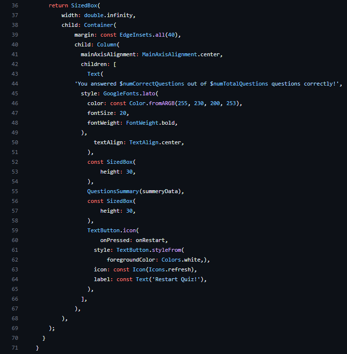

# Dice Roller - Dart & Flutter Project
<h2>Prewview</h2>
 

<h2>Screenshots</h2>
  

      
Main <small><strong>(Click me)</strong></small>

       
  

  

      
Answer Button <small><strong>(Click me)</strong></small>

       
  

  

      
Questions <small><strong>(Click me)</strong></small>

       
       
  

  

      
Questions Identifier <small><strong>(Click me)</strong></small>

       
  

  

      
Questions Screen <small><strong>(Click me)</strong></small>

       
       
  

  

      
Questions Summery <small><strong>(Click me)</strong></small>

       
  

  

      
Questions Summery Item <small><strong>(Click me)</strong></small>

       
       
  

  

      
Quiz <small><strong>(Click me)</strong></small>

       
       
  

  

      
Quiz Questions <small><strong>(Click me)</strong></small>

       
  

  

      
Result Screen <small><strong>(Click me)</strong></small>

       
       
  

  

      
Start Screen <small><strong>(Click me)</strong></small>

       
       
  

<h1>Technologies</h1>
<ol>
    <li>
        <h3>Git</h3>

         
        Why <a href="https://git-scm.com/" target="_blank">Git</a>: 
        Git is a DevOps tool used for source code management. It is a free and open-source version control system used to handle small to very large projects efficiently. Git is used to tracking changes in the source code, enabling multiple developers to work together on non-linear development.
        

    </li>
    <li>
        <h3>Github</h3>

         
        Why <a href="https://github.com/" target="_blank">Github</a>: 
        Well It's used for storing, tracking, and collaborating on software projects. It makes it easy for developers to share code files and collaborate with fellow developers on open-source projects. GitHub also serves as a social networking site where developers can openly network, collaborate, and pitch their work 
        

    </li>
    <li>
        <h3>Dart</h3>

         
        Why <a href="https://dart.dev/" target="_blank">Dart</a>: 
        Being a compiled language, Dart allows developers to discover programming errors during the compilation process. 
        Hence, it is considered a type-safe language. 
        On the other hand, 
        Java is an interpreted language and allows developers to find programming errors during the runtime.
        

    </li>
    <li>
        <h3>Flutter</h3>

         
        Why <a href="https://docs.flutter.dev/" target="_blank">Flutter</a>: Allows developers to build a single codebase and use it for several platforms such as the web, desktop and mobile. This results in quicker app launch and is cost effective. Reduced Development Time: The requirements for Flutter application development are much lower. 
        

    </li>
        <li>
        <h3>Android Studio</h3>

         
        Why <a href="https://docs.flutter.dev/" target="_blank">Android Studio</a>: Android Studio helps you debug and improve the performance of your code, including inline debugging and performance analysis tools. 
        <small><a href="https://developer.android.com/studio" target="_blank">Download here</a></small>
        

    </li>
</ol>